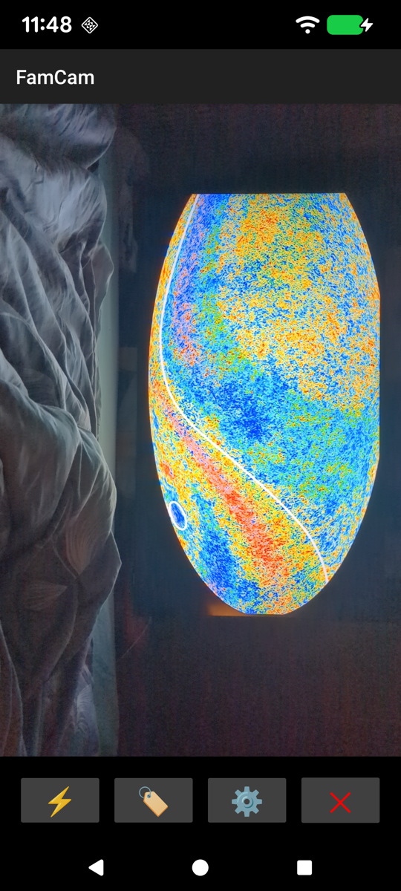
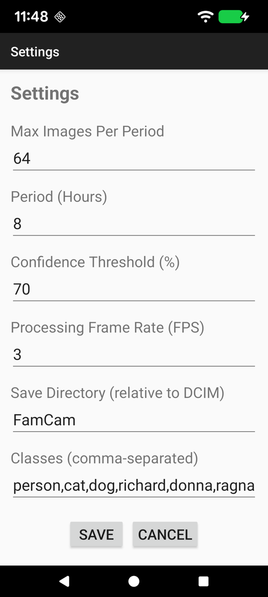
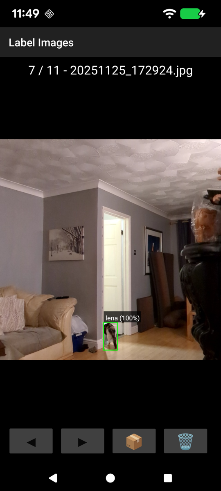

# FamCam

<p align="center">
  
</p>

<p align="center">
  <strong>Create datasets for training YOLO to recognize familiar people and pets</strong>
</p>

---

FamCam is an Android camera app that automatically captures and labels photos of your family members and pets, creating perfectly formatted training datasets for YOLO object detection models.

Open FamCam then leave your phone around your house or pointing into your garden etc.
FamCam recognises humans, cats and dogs, and when it does so it it will save an image complete
with 'bounding box' information about where in the image that human/dog/cat was seen.

To train yolo nano models you'll probably need a few hundred images of each person/pet in
differing light conditions and from differing angles

When you think you've collected enough images, you can modify the setting to add the name of the things you've captured
and then use the labelling feature to label the bounding box with the correct person/animal.

When all your images are correctly annotated, you can export the whole thing in a zip file to your Downloads directory
from where you can send it to your PC for training.

For information about how to use the training data, see "Ultralytics, Yolo Nano"

Once your model is trained, you can now mount a camera anywhere and use your model to see who's in your house, and
perhaps, who shouldn't be!

## Features

✨ **Automated Photo Capture** - Detects people and pets, saves images automatically
🏷️ **Easy Labeling** - Touch bounding boxes to assign names
📦 **YOLO Export** - One-tap export to standard YOLO training format
⚡ **Power Mode** - Run 24/7 with minimal battery drain
🎯 **Smart Detection** - Built-in YOLOv8 Nano model

## Screenshots & Usage

### Main Screen - Photo Capture

<p align="center">
  
</p>

The main screen shows the live camera feed with real-time object detection.

**Controls:**
- **⚡ Power** - Toggle power mode (keeps screen on with dimmed display for continuous operation)
- **🏷️ Label** - Open the image labeling interface to annotate captured photos
- **⚙️ Settings** - Configure capture intervals, detection confidence, and class names
- **✕ Quit** - Exit the application

**Detection Overlay:**
- Green bounding boxes show detected objects in real-time
- Labels display the detected class and confidence percentage
- Images are automatically saved when people, cats, or dogs are detected

---

### Settings Screen

<p align="center">
  
</p>

Configure how FamCam captures and processes images.

**Settings:**
- **Max Images Per Period** - How many images to capture in the time window (default: 64)
- **Period (Hours)** - Time window for max images (default: 8 hours)
- **Confidence Threshold (%)** - Minimum detection confidence to save images (default: 70%)
- **Processing Frame Rate (FPS)** - How often to analyze camera frames (default: 3 FPS)
- **Save Directory** - Folder name in DCIM where images are stored (default: FamCam)
- **Classes (comma-separated)** - Names for labeling your family and pets (default: person,cat,dog,richard,donna,ragnar,heath,amber,lena)

**Auto-save Interval:** Images are saved at regular intervals calculated as: `(Period Hours × 3600) / Max Images` seconds. With defaults, this means one image every 7.5 minutes when objects are detected.

---

### Labeling Screen - Annotate Your Dataset

<p align="center">
  
</p>

Review captured images and assign specific identities to detected objects.

**Controls:**
- **◀ Previous** - View previous image
- **▶ Next** - View next image
- **📦 Export** - Export all labeled images as a YOLO-format dataset ZIP file
- **🗑️ Delete** - Remove the current image
- **✕ Back** - Return to main screen

**Labeling Workflow:**
1. Bounding boxes from detection are displayed on each image
2. Tap any bounding box to open the class selection menu
3. Choose the correct identity (e.g., "richard", "donna", "cat")
4. The system will request permission to modify the image
5. Labels are saved directly to the image's EXIF metadata
6. Navigate through all images to complete your dataset

**Image Info:** The top bar shows your position in the dataset (e.g., "1 / 9") and the current filename.

---

## Export Format

When you tap the **📦 Export** button, FamCam creates a ZIP file at `/sdcard/Download/FamCamData.zip` with the following structure:

```
FamCamData.zip
├── coco.yaml          # Dataset configuration with class names
├── images/            # All captured images (640x640 JPEG)
│   ├── 20251125_163509.jpg
│   ├── 20251125_172154.jpg
│   └── ...
└── labels/            # YOLO format annotations (.txt)
    ├── 20251125_163509.txt
    ├── 20251125_172154.txt
    └── ...
```

**Label Format:** Each `.txt` file contains one line per object:
```
classId centerX centerY width height
```
Example: `3 0.489 0.287 0.182 0.149` (class 3, normalized coordinates)

**coco.yaml:** Maps class IDs to names for YOLO training:
```yaml
names:
  0: person
  1: cat
  2: dog
  3: richard
  4: donna
  ...
nc: 9
train: images
val: images
```

This format is ready to use with YOLOv8 training scripts.

---

## Installation

### Requirements
- Android 7.0 (API 24) or higher
- Camera permission
- Storage permission (for saving images)
- ~50 MB storage space

### Install
1. Download the latest APK from [Releases](https://github.com/richard-senior/FamCam/releases)
2. Enable "Install from Unknown Sources" in Android settings
3. Open the APK file to install
4. Grant camera and storage permissions when prompted

---

## Usage Tips

### Collecting Training Data

1. **Set up your classes** - Go to Settings and add names of family members and pets in the "Classes" field
2. **Enable Power Mode** - Tap ⚡ to keep the app running continuously
3. **Position the device** - Place your phone where it can see common areas (living room, kitchen, etc.)
4. **Let it run** - FamCam will automatically capture images when it detects people or pets
5. **Label periodically** - Use the 🏷️ button to review and label captured images
6. **Export when ready** - Tap 📦 to create your training dataset

### Power Mode Best Practices

- Plug in your device to prevent battery drain
- The screen will dim to minimum brightness automatically
- A dark overlay reduces screen burn-in
- The app continues capturing even with the dimmed screen
- Disable power mode when you need to use your phone normally

### Labeling Tips

- You can label images at any time - they don't need to be labeled immediately
- Labels are stored in the image EXIF data, so they persist even if you uninstall the app
- Delete blurry or unwanted images with the 🗑️ button
- Export multiple times as you collect more data - the ZIP file is overwritten each time

---

## Privacy & Data

- All images are stored locally on your device in `DCIM/FamCam/images/`
- No data is sent to external servers
- You have complete control over your images
- Delete the app and folder to remove all data
- Exported ZIP files remain in your Downloads folder until you delete them

---

## Building from Source

```bash
git clone https://github.com/richard-senior/FamCam.git
cd FamCam
./gradlew assembleDebug
adb install -r app/build/outputs/apk/debug/app-debug.apk
```

---

## Technical Details

- **Detection Model:** YOLOv8 Nano (12.7 MB, 80 COCO classes)
- **Image Size:** 640×640 pixels
- **Processing:** TensorFlow Lite on-device inference
- **Storage:** MediaStore API with EXIF metadata
- **Permissions:** Camera, READ_MEDIA_IMAGES, POST_NOTIFICATIONS

---

## License

MIT License - See LICENSE file for details

---

## Contributing

Contributions welcome! Please open an issue or pull request.

---

## Support

For issues or questions, please open an issue on GitHub.
